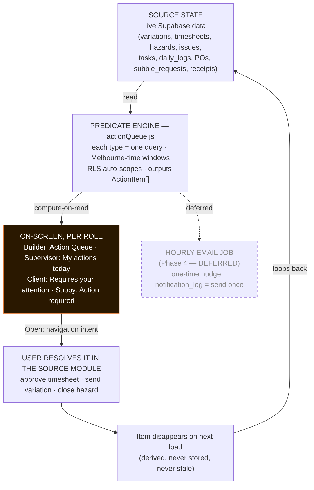

# SITE1 — Action Queue (Attention Centre): Diagram Brief

**Purpose:** Feed this whole file to an AI (Claude, etc.) and ask: *"Create a clean, professional flow diagram / illustration from this."* It contains the concept, the node-by-node structure, the data flow, a per-role legend, suggested styling, and an ASCII reference of the intended layout.

---

## One-line concept
The Action Queue is a **derived "what needs doing" layer**: it computes each user's outstanding actions live from the app's current data on every screen load, surfaces them per role, and items **auto-disappear** the moment the underlying thing is resolved — nothing is ever stored or manually "ticked off."

---

## Illustration request (paste-ready)
> Create a clean, modern **vertical flow diagram** (top-to-bottom) titled **"SITE1 — Action Queue (Attention Centre)."** Use a dark UI aesthetic: near-black background (#0c0c0c), card surfaces in dark grey (#141414 / #1a1a1a), an orange accent (#e07b39) for emphasis and arrows, white/light-grey text. Boxes are rounded rectangles. Show one main vertical pipeline with a side branch, and a feedback loop arrow returning to the top. Label everything clearly. Keep it professional and uncluttered — suitable for a product spec or investor deck.

---

## Nodes (top → bottom)

1. **SOURCE STATE** (top box) — "Live Supabase data — the single source of truth."
   Sub-text / chips: `variations`, `timesheets`, `hazards`, `issues`, `tasks`, `daily_logs`, `purchase_orders`, `subbie_requests`, `commercial_items (receipts)`.

2. **Arrow down** labelled *read*.

3. **PREDICATE ENGINE** (box) — `src/lib/actionQueue.js`. Bullet points inside:
   - each action type = **one query** over current state
   - **Melbourne-time** windows (overdue / 6pm cutoff / shift > 10h)
   - **RLS auto-scopes** to the user's own projects/data
   - outputs `ActionItem[]` with: `type`, `priority`, `ageHours`, `description`, `target {kind, projectId, entityId}`

4. **Split into two branches:**
   - **Left branch — COMPUTE-ON-READ** (label: "runs on every dashboard load") → leads to node 5.
   - **Right branch — HOURLY JOB** (label: "Phase 4 — DEFERRED, email only", draw greyed-out / dashed to show it's not built yet) → leads to node 6.

5. **ON-SCREEN, PER ROLE** (box, the main path, highlight in orange) — "Attention sections, one per role":
   - Builder → *Action Queue*
   - Supervisor → *My actions today*
   - Client → *Requires your attention*
   - Subby → *Action required*
   - small note: "priority badges, count, sorted high→low then oldest-first"

6. **ONE-TIME EMAIL NUDGE** (box, dashed/greyed) — "for time-based items only (signoff overdue, daily-log missing, shift too long). `notification_log` = send-once guarantee. NOT YET BUILT."

7. From node 5, an **[ Open ] button** element → arrow labelled *"navigation intent → opens the exact resolving screen"* → down to node 8.

8. **USER RESOLVES IT IN THE SOURCE MODULE** (box) — examples: "approve the timesheet · send the variation · close the hazard."

9. **Arrow down** to a result note: *"source state changes ⇒ predicate no longer matches ⇒ item disappears on next load (no 'mark done', never goes stale)."*

10. **Feedback loop arrow** from node 9 curving back up to node 1 (SOURCE STATE), labelled *"loops back."* This closes the cycle and visually conveys "self-maintaining."

---

## Per-role legend (render as a small table or side panel)

| Role | Section title | Example items |
|---|---|---|
| **Builder / Office** | Action Queue | variation awaiting pricing / issue / sign-off overdue / rejected · timesheet to approve · PO unaccepted · high-risk hazard · receipt to confirm |
| **Supervisor** | My actions today | daily log outstanding (after 6pm) · overdue task · open hazard · open issue · shift open too long |
| **Client** | Requires your attention | a variation awaiting your approval |
| **Subcontractor** | Action required | new PO to accept · request outcome you haven't viewed *(never any financial figures)* |

---

## Key properties to convey visually
- **Derived, never stored** — emphasise the loop; no database/"actions table" node.
- **Auto-resolving** — the disappear-on-resolve step is the punchline.
- **Role-scoped & secure** — each role only sees their own slice (RLS).
- **Two paths, one engine** — on-screen (built) vs. hourly email (deferred/greyed).

---

## ASCII reference of the intended layout

```
                 SITE1 — ACTION QUEUE  (Attention Centre)

  ┌───────────────────────────────────────────────────────────────────┐
  │  SOURCE STATE  — live Supabase data, the single source of truth    │
  │  variations · timesheets · hazards · issues · tasks · daily_logs   │
  │  purchase_orders · subbie_requests · commercial_items (receipts)   │
  └───────────────────────────────────────────────────────────────────┘
                                 │ read
                                 ▼
  ┌───────────────────────────────────────────────────────────────────┐
  │  PREDICATE ENGINE   src/lib/actionQueue.js                         │
  │  • each action type = ONE query over current state                 │
  │  • Melbourne-time windows (overdue / 6pm cutoff / shift too long)  │
  │  • RLS auto-scopes to the user's own projects/data                 │
  │  ⇒ ActionItem[] { type, priority, ageHours, description,           │
  │                   target:{kind, projectId, entityId} }             │
  └───────────────────────────────────────────────────────────────────┘
            │                                            │
   COMPUTE-ON-READ                              HOURLY JOB ── Phase 4,
   (runs every dashboard load)                  DEFERRED (email only)
            │                                            │
            ▼                                            ▼
  ┌─────────────────────────────┐            ┌──────────────────────────┐
  │  ON-SCREEN, PER ROLE         │            │  ONE-TIME email nudge     │
  │  • Builder  → Action Queue   │            │  for time-based items     │
  │  • Supervisor → My actions   │            │  (signoff overdue, daily  │
  │  • Client → Requires attn.   │            │   log missing, shift >10h)│
  │  • Subby → Action required   │            │  notification_log =       │
  │  (badge counts, hi→lo sort)  │            │  "send once" guarantee    │
  └─────────────────────────────┘            └──────────────────────────┘
            │
        [ Open ]  ── navigation intent (no URLs in SITE1)
            │        opens the exact resolving screen
            ▼
  ┌───────────────────────────────────────────────────────────────────┐
  │  USER RESOLVES IT IN THE SOURCE MODULE                             │
  │  approve the timesheet · send the variation · close the hazard ··· │
  └───────────────────────────────────────────────────────────────────┘
            │
            ▼
   source state changes ⇒ predicate no longer matches ⇒
   item DISAPPEARS on next load   (no "mark done", never goes stale)
            │
            └──────────────── loops back to SOURCE STATE ─────────────►
```

---

## Optional: Mermaid version (renders directly in many tools)


